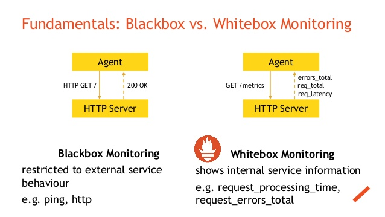

## Monitoring
Catagory-1 : end user application business will be impacted if stops the services - high priority

Catagory-2 : end user application for other request ,business will be impacted if stops the services- second high priority

Catagory-3: business will not be impacted if stops the services

Catagory-4: business will not be impacted if stops the services

### SRE responsibles
- maintain jenkins , nexus, Sonarqube,Ansible, EKS and other tools.
    - setting Authentication and Autherization 
    - upgrades
    - patches
    - maintain --> admin activities 
- Project creation 
    - checking taffic
    - **monitoring** --> tool/website should be running 24*7 with low latency.

- for black-box , normal user can test , checking applications ,like login , logout, post, get etc.(external-user)

- for white-box , normal user can't test, only application realated employees will do , checking applications metrics ,like CPU , memory,t etc (internal-user)

### Terminology 
- Dashboard
- Alert
    - Alerts are considered as high important , once get alerm, need to investigate server etc , to find root cause.
- root cause
- Push (ansible)

## The Four golden signals
- Latency
    - latency should be low
- Traffic
    - measure traffic every time
- Errors
    - Log errors, application errors,no need to wait complaints from user.
- Saturation
    - mesuring CPU, memory , no need to reources complition , hour to hour measure and , identify increate configuration.

Note: 
    
    - ELK
        - latency | Traffic | Error
    
    - Prometheus - grafana
        - Saturation